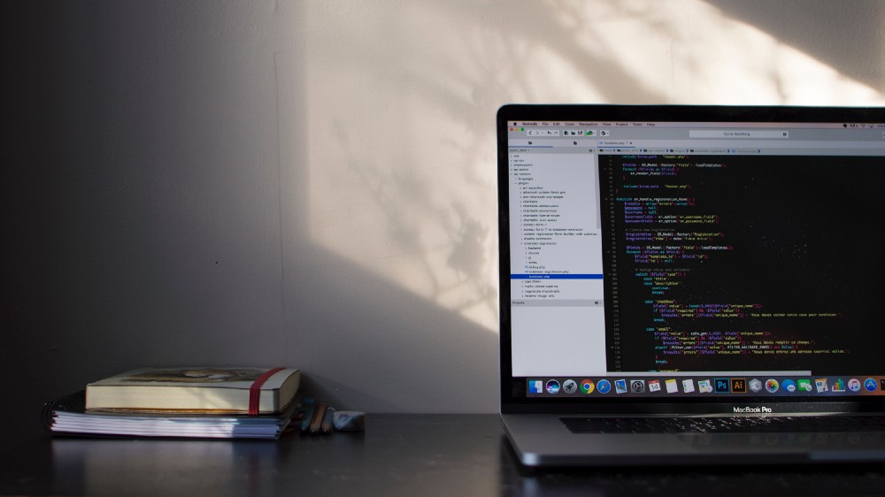
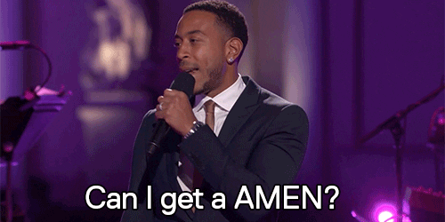
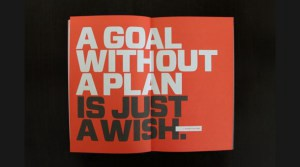

## WHAT IS IT?

This is a challenge that was created by Alexander Kallaway and he first wrote this [article](https://medium.freecodecamp.com/join-the-100daysofcode-556ddb4579e4) about it. Since then, it has garnered so much support in the field that it has now become a norm, especially for beginners like myself. The goal of the whole challenge as highlighted by Kallaway is to ensure you code for a minimum of an hour every day for the next 100 days. Challenging right? The goal is to find the motivation to make coding a habit.

> “A journey of a thousand miles begins with a single step.” — Lao Tzu

_**Related Read:** [Improve with the #100DaysOfCode Movement: Rounds, Resistance, and Adaptation](https://medium.freecodecamp.org/the-100daysofcode-movement-rounds-resistance-and-adaptation-432429cc3306)_

Success stories such as [this](https://code.likeagirl.io/my-100daysofcode-experience-the-good-the-bad-and-the-ugly-ee1263131f15), [this](http://benlevy.com/blog/100-days-coding/) and [this](https://medium.freecodecamp.org/what-i-learned-from-my-first-100daysofcode-13ac805ff0a9) and so many others are one of the many reasons the challenge has become very popular today. The challenge even has a [Slack channel, a YouTube channel as well as a Discord channel and Instagram account](http://www.100daysofcode.com/connect/).

## HOW DO I JOIN?

If you feel you are ready for the challenge, then joining is pretty simple. All you have to do is fork this [Repository](https://github.com/Kallaway/100-days-of-code) where you log about your daily progress. Also, use the Twitter hashtag [#100DaysOfCode](https://twitter.com/search?q=%23100DaysOfCode&src=tyah) to tweet about your progress and then support those who are doing the challenge. You can find out more on the repo. For full details or information, you can reach out to Kallaway on [Twitter](https://twitter.com/ka11away) or visit the official [#100DaysOfCode Website](http://100daysofcode.com/). You can also read this [comprehensive article](https://medium.freecodecamp.org/the-crazy-history-of-the-100daysofcode-challenge-and-why-you-should-try-it-for-2018-6c89a76e298d) by Quincy Larson.

## WHY AM I DOING IT?

After months of speculation, I have decided to join the #100DaysofCode challenge. This will not be the first time I will be committing to this, first time I got halfway but unfortunately school and exams got in the way and I couldn’t keep up.

<blockquote class="twitter-tweet">
Starting <a href="https://twitter.com/hashtag/100DaysofCode?src=hash&amp;ref_src=twsrc%5Etfw">#100DaysofCode</a> tomorrow. Follow my daily log on github <a href="https://t.co/Q6es5GT2xW">https://t.co/Q6es5GT2xW</a>
&mdash; Emmanuel Raymond (@peoray_) <a href="https://twitter.com/peoray_/status/858427384349044737?ref_src=twsrc%5Etfw">April 29, 2017</a></blockquote> 

<!-- https://twitter.com/peoray_/status/858427384349044737 -->

At that stage, my coding experience isn’t as it is now and I wasn’t feeling the level of motivation I feel now. Also, I was alone, didn’t have mentors, friends who code or anyone to push me, I was all alone and that was a big factor. But I’m glad I’m doing it now, I mean there is no better time than now and I hope to start and finish without missing a day.

My goal is to grow and improve my skills, as this challenge will help me keep track of my activities. Also, by doing this challenge, I hope to tackle my bad habit of starting a project and abandoning it half-way. I want to be able to build projects to show off in my portfolio and build my confidence overall.

I hope to achieve the following the following goals during this time:

- Improve my JavaScript skills

- Improve my CSS abilities (Flexbox, CSS Grid, Animations, transitions, transforms, etc.)

- Getting comfortable using Sass

- Start[ #30Days30Sites](http://www.subscribepage.com/30days30sites)

- Learn Vue.js

- Learn new tips and tricks.

- Finish at Least five online courses (preferably Udemy)

- Write technical blog posts.

- Build stuff. Lots of them!!!

Well, I’m pumped up and I can’t wait to see how this turns out. You can follow my daily [tweets](https://twitter.com/super_raay/status/950187188104454145) or check out my daily log on my [GitHub repo](https://github.com/peoray/100-Days-Of-Code). Also, you can check out my [learning tracker](https://github.com/peoray/My-Learning-Tracker) to keep up to date with my progress. I will be writing about my experience about the challenge in the next 100 days from today. So until then, Happy Coding!
