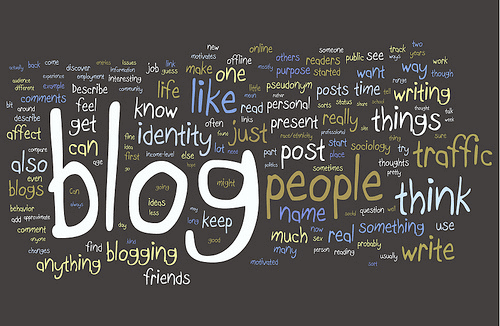
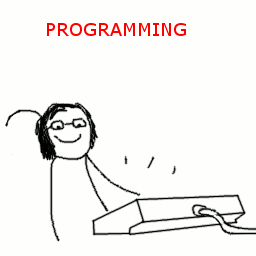
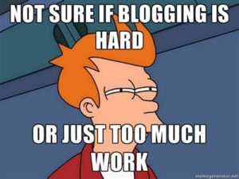
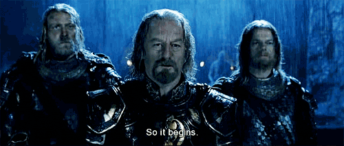

Welcome to my first blog post! I felt that it would be customary for me to use a timeless greeting all techies and geeks would be used to seeing. I’ve been meaning to start a blog for a very long time, but I tend to procrastinate, one of the many reasons I am starting this blog. Finally, today I am writing my first ever article.

# Why a Blog?

So over the years, I have read a lot! A lot of it goes in and doesn’t stick. So my plan is to take something I want to learn about,read about it, play around with it, create some demos and write about what I have learned.

In summary, here is a list of why I want to blog:

- [One of the best ways to learn](http://psychology.about.com/od/educationalpsychology/tp/effective-learning.htm) is to Teach What You’ve Learned to Another Person (TWYLAP).

- A public journey of my experience through life.

- Improve my writing skills.

- To keep my own journal.

- To market myself, show who I am, and what my interests and beliefs are.

# What to Blog About?

So what sort of interesting things will I be blogging about? Well, I’ll be writing about my thoughts, actions, successes, failures, lessons and experiences. Nowadays, my life revolves around tech, software and code (I’m a beginner, I like the tag), so you will be seeing lots of posts about that. If you are into programming, then you might want to follow me.

I will also be writing about my monthly goals I hope to achieve, tips, advice, motivational and inspirational posts, quotes, books I read and even movies I watch (I hope I don’t get to do this). I hope to get into blogging about my myriad experiences (whenever I get them), my travels, food, places, life moments and about everything else that matters to me.

Too much right? Well, now you know why it’s called a Personal Blog (there are no rules!)

# What’s the plan?

It took me quite a long time to write this and publish, so you can imagine how hard it can be to blog. Little wonder most people tend to get started and abandon it later. So, I will be keeping things simple, don’t expect daily or weekly posts!

# Simple Right?

So everything looks simple and good enough. I’d recommend if you are reading my articles to be active, comment, like and share and don’t forget to subscribe o my newsletter (I promise not to feel bad if you don't).

So whats the point of it all? Well, to document my journey in life and to share it with the world!

So stay tuned and let the show begin!

