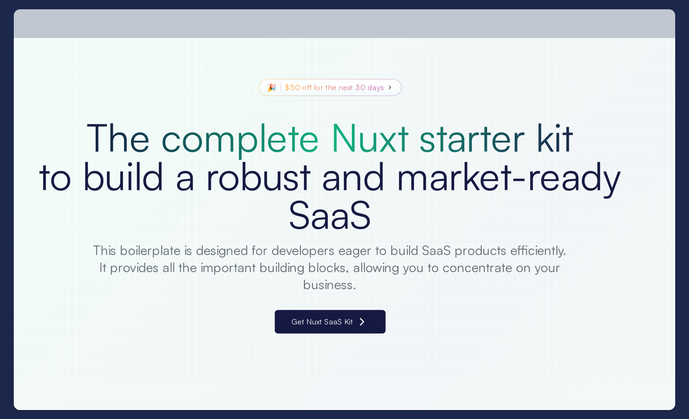

## Beginnings are hard

If I could use a word to describe July, it would be ‘challenging’. In July, I decided to venture into uncharted territory by creating and monetizing my products — a first for me. Amidst taking a break from work, battling burnout, and navigating the turbulent tech job landscape, I paused my job search and focused on creating opportunities instead.

## Why this, why now?

For over two years, I have been exploring the indie hacking community. I have read countless articles on IndieHackers, Reddit, and more; bookmarked inspirational posts on X; listened to hundreds of podcasts; and binge-watched YouTube videos. I’ve followed creators like Pieter Levels and absorbed everything I could about building successful online businesses.
 
The only thing I haven’t done until now is take action, which I’ve finally decided to do. I’m taking the plunge and facing my fears.

## The Grand Plan

At the start of July, I set an ambitious goal: to launch three products by the end of the year. This is my top priority, alongside other personal goals.
 
While making money from these products would be awesome, my primary aim is to:

- Enjoy the process of creation and learn as much as possible.

- Learn the entire process of starting, finishing and marketing projects.

- Build a portfolio of projects that showcase my skills beyond my past employments.

This journey is about more than just creating products; it's about personal growth, overcoming fears, and learning to start and finish projects.

## July Highlights

I teamed up with a friend for this new venture, and we crafted a detailed roadmap to guide us. With shared goals and a clear direction, we identified the projects we wanted to tackle first.

Currently, we are building Nuxt SaaS Kit, a boilerplate for Vue/Nuxt developers who want to launch products in record time. This type of product is quite popular in the indie hacking space; however, all of them are tailored for React/Next developers, so we noticed a market gap and decided to provide an alternative for Vue/Nuxt developers like ourselves. This was a good way to build momentum and provide us with a codebase to launch future projects much faster.

The project is almost complete, but it is pending when our payment gateway approves our store and the documentation is ready. We're offering one of the most affordable boilerplates on the market, packed with features like authentication, a landing page, database setup, payment integration, email functionality, a blog, and more. We’ll be working on adding AI capabilities for those interested in launching AI-related SaaS.

## August Goals

My primary goal for this month is to launch Nuxt SaaS Kit, the first of the three products I plan to release this year.

Additionally, I aim to build genuine connections on social media and be part of the #buildinpublic audience. One of my biggest challenges has been overcoming the anxiety of putting myself out there. It's been a career-stumbling block, but I'm determined to change that. I’ve started to engage more on platforms like X, pushing myself to respond to posts and share my thoughts. It's uncomfortable, but I'm finding my voice, post by post.
 
LinkedIn and Reddit are other platforms I’m tackling. They're not just networking platforms but potential marketing channels for our products. Hopefully, I’ll announce the launch of this newsletter and Nuxt SaaS Kit there.

Each post and each comment is a small victory in my battle against social anxiety.

## Moving Forward

This newsletter will serve as an accountability tool and a monthly reflection. Every month, I will share a summary of my activities and the progress I've made towards my goal. My blog remains my main source of writing, where I'll share my progress, learnings, and the inevitable challenges I'll face along the way.

I still haven’t decided on the name for the newsletter, so it might keep changing over time until I find something I’m at peace with.

Until next time, when I hope to come bearing news of a successful launch, stay curious and keep building!

Onwards to August and beyond!
