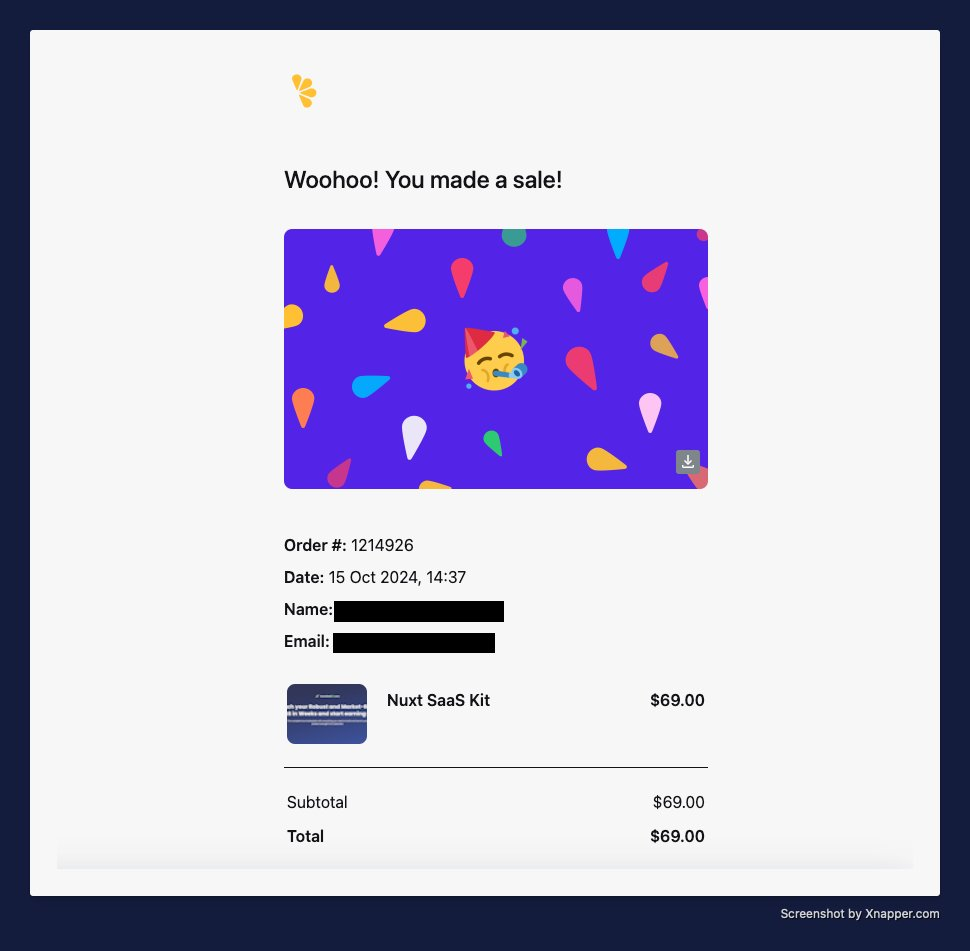
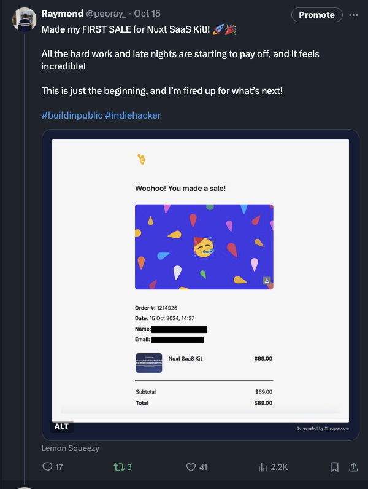
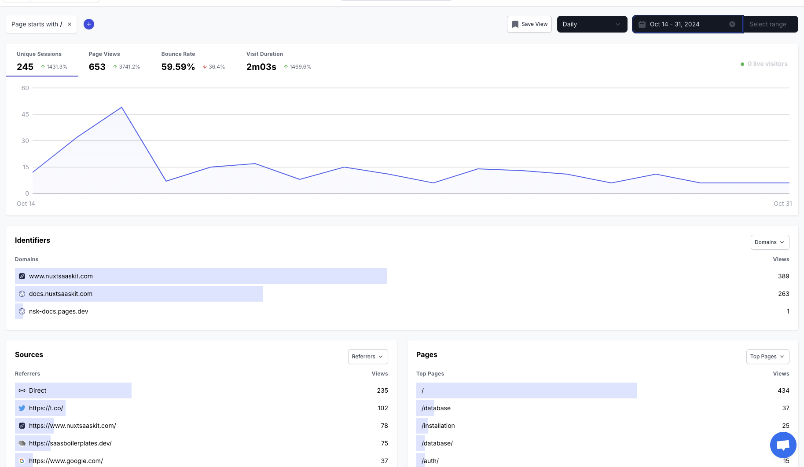

After months of preparation and overcoming various hurdles, October marked several significant milestones, including the public launch of Nuxt SaaS Kit.

The biggest highlight of October was publicly launching [Nuxt SaaS Kit](https://nuxtsaaskit.com/?ref=peoray.dev). If you’re a Vue/Nuxt developer looking to build SaaS projects, Nuxt SaaS Kit is designed to streamline the setup process, taking the complexity out of your hands so you can focus on your business logic. I [tweeted](https://x.com/peoray_/status/1845908078874464533) about the launch, and it got a good reception. However, I can’t help but think it would’ve been even stronger had I been more vocal about the product beforehand.

## The First Sale: A Milestone to Remember

The most exciting moment was securing our first sale. The feeling of seeing that first purchase notification is indescribable—a mixture of pride, validation, and motivation to push further.

That first purchase post on X became my most engaging tweet, and the community's support was great.

As of now, we’ve made two sales. With a one-time payment product, maintaining momentum is essential. Your success is directly tied to consistent marketing efforts. When you stop talking about your product, sales naturally drop. This was evident during my period of reduced activity on X. I have learned that ongoing visibility directly impacts sales. I plan to stay more active on X and other channels to keep Nuxt SaaS Kit in the spotlight.

Our goal isn’t necessarily to make life-changing revenue from this project but rather to create a strong foundation for future products. By continuously improving Nuxt SaaS Kit as we use it, we’re dogfooding the product and adding value for our users along the way.

## Marketing Efforts

With the product live, I began experimenting with various marketing approaches:

- Submitting to directories

- Engaging with Reddit posts about boilerplates

- Sharing updates on X

While these efforts have shown promise, I acknowledge they're just the beginning. Looking at our analytics from October 14-31, our marketing strategy clearly has room for growth and optimization.

With the launch behind me, November’s focus will squarely be marketing. Some of the goals I have include:

- Launch free tools.

- Write blog articles.

- Share on other platforms such as Reddit, Indie Hackers, etc.

- Launch on Producthunt and other platforms.

- Record a demo video walkthrough.

Right now, our domain rating according to [Ahrefs](https://ahrefs.com/website-authority-checker/?input=nuxtsaaskit.com) is 3.5. The goal is to gradually increase it to be able to rank higher on Google.

## Final Thoughts

October has been a month of firsts—first public launch, first sales, first taste of what it feels like to have customers choose your product. While these milestones might seem modest in the grand scheme of things, they represent something more significant: the transition from building in isolation to creating value for real users.

The journey hasn't been a straight line, and I expect the path ahead to have its twists and turns. Every successful business starts somewhere, and these small wins are the foundation we'll build upon.

Thank you for following along on this journey. If you're also navigating a project launch, let’s connect!

Until next time, keep building!
