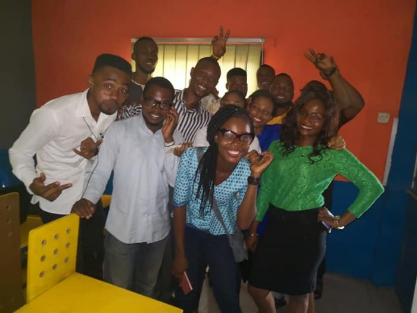

[LearnFactory](http://learnfactory.com.ng/about-us/) is a company that is committed to grooming great men and women with character and capacity. It is a collaborative tech environment that provides training in software engineering skills relevant in the industry today with access to cutting-edge tools and provides an opportunity for aspiring tech entrepreneurs, enthusiasts and creative people to meet, learn, showcase their ideas and work together towards solving social and business needs using homegrown technology and solutions.

The [LearnFactory](https://techpoint.ng/2017/12/06/learnfactory-aba-feature/) Internship is a six months free intensive training aim at creating the next generation of software developers who will be able to build solutions to problems in their society and the world at large using cutting-edge tools. The curriculum is top-notched and equipped with all the relevant and latest technologies such as GraphQL.

Having gone through the selection process, it was a thing of pride as I was selected as one of the successful candidates. The biggest challenge was making the journey to the [business city of Aba](https://techpoint.ng/2018/01/16/restoring-aba-to-former-glory/) from Abuja This meant leaving my comfort zone. Aba is certainly not the place I would choose to be but as Napoleon Hill said:

> Great achievement is usually born of great sacrifice and is never the result of selfishness.
>
> _- Napoleon Hill_

Most people thought I was crazy, I thought so too but decided to make the journey nevertheless.

My first day was definitely beyond my expectation. Meeting the other successful interns was certainly the highlight of the day for me. These are the people who are gonna be in my face for the next six months, who probably will go on to become life-long friends and partners. As with most situations, being in a place for the first time and meeting new people, everyone kept to themselves but after the introductions were done, the whole place came into life with everyone chatting and laughing as if they have known each other for long. I’m not the ‘I love making new friends type’ but in this case, I had no option because the energy in the room was too great to be ignored. I was only glad to meet happy people who despite coming from different background are able to instantly connect with each other.

There were talks via Google hangouts from the amazing [Aniedi Udo-Obong](https://twitter.com/aniediudo?lang=en), the Google Program Manager, Developer Ecosystem for Sub-Saharan Africa, who spoke about his humble beginning and how he was able to turn things around for himself despite the many challenges he encountered and Daniel Chinagozi, the founder of [Innovation Growth Hub](https://ighub.com.ng/), who advised the interns on the seriousness of the program and charging us to take full advantage of the opportunity.

There were also introductions from the staff, those who have made the huge sacrifice to train and mentor the next superstars of software development.

Then we got down to business and got our hands dirty with a rapid review of Linux, as this is the operating system we will be using during the internship. I’m still scared of the terminal and I certainly miss my friendly neighbour Windows

The day wouldn’t be complete without the interns being treated to a delicious lunch of the famed Nigerian Jollof.

At the end of it all, it was the start of a beautiful experience for everyone. Hopefully, at the end of the internship, most of us would have achieved our goals and be on our journey to do greater things.

_**Cheers!**_
